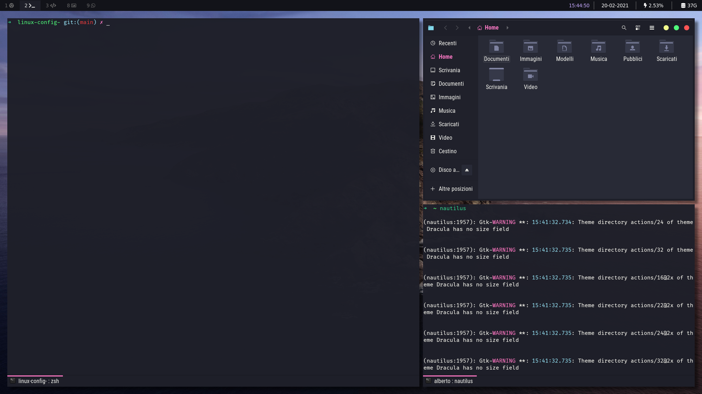

# linux-config-

I'm using a Linux Mint installation with **i3-gaps** window manager, **rofi**, **picom**, **oh-my-zsh**.
Here you can find the config files that i store in *tilde/.config/* or *tilde/*.

### Features:
- multiple, smart workspaces, where each app knows where to spawn
- automatic tiling
- beautiful gaps and shadows between windows
- smooth window transitions
- a glorious shell
- an useful bar
- incredibly intuitive shortcuts
- featuring [Dracula theme](https://draculatheme.com/)

### Some screenshots follow:
:warning: TO BE UPDATED :warning:

:warning:

### Conclusions
This setup led to an increase in coding productivity and allowed me to understand a bit better how linux can be customized.

### TODO:
- improve zsh functionalities through plug-ins
